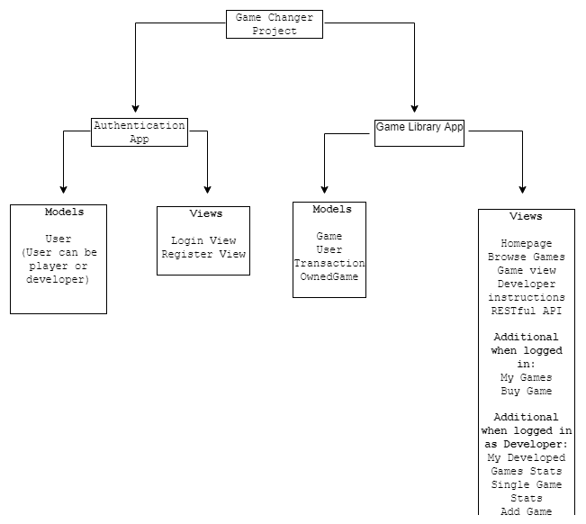
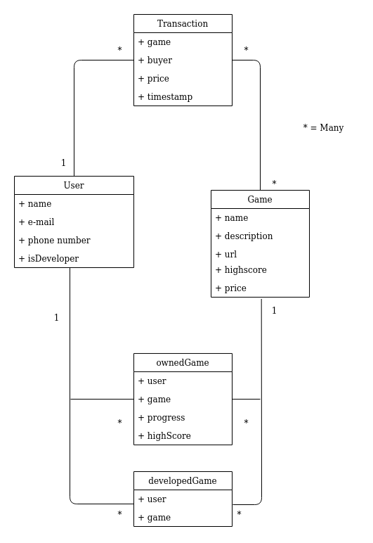

# Game X Changers

CS-C3170 Web Software Development 2019 / 2020 
Course Project

Tervo, Miikka   654058  miikka.tervo@aalto.fi  
Jokinen, Ekku	666091	ekku.jokinen@aalto.fi  
Määttä, Arttu	667155	arttu.maatta@aalto.fi

## Final Submission

## Implemented features and work distribution

## Authentication (Ekku, 200/200 points):
We did Login, logout and register (both as player or developer). Email validation through Django console backend.

## Basic player functionalities (Arttu, Miikka, 300/300 points): 
Buy games, payment is handled by the course’s mockup payment service: https://tilkkutakki.cs.aalto.fi/payments/
“Giving” the game to a player is done using the PID coming from payment service. So people can’t get other people’s games. 
Play games. See also game/service interaction
Security restrictions, e.g. player is only allowed to play the games they’ve purchased
Players find games through a search functionality that searches from game names and descriptions. Also most played game is displayed on front page.

## Basic developer functionalities (Arttu 200/200 points):
Add a game (URL) and set price for that game and manage that game (remove, modify) through a my Games view.
Basic game inventory and sales statistics (how many of the developers' games have been bought and when)
Security restrictions, e.g. developers are only allowed to modify/add/etc. their own games, developer can only add games to their own inventory, etc.

## Game/service interaction (Miikka 200/200 points):
When player has finished playing a game (or presses submit score), the game sends a postMessage to the parent window containing the current score. This score is recorded to the player's scores and to the global high score list for that game. 

## Quality of Work (100/100 points):
Structure is good.
Using django well.
Testing is ok. 
Commits and comments are ok.

## Non-functional requirements ( 200/200 points):
Project plan was well done, even though there were some faults in the content. Planning was done well though.
Overall documentation, demo, teamwork, and project management as seen from the history of your GitLab project (and possible other sources that you submit in your final report)

## Save/load and resolution feature (Miikka 100/100 points):
The service supports saving and loading for games with the simple message protocol described in Game Developer Information.

## 3rd party login (Ekku 100/100 points)
Allow facebook login to the service for both developers and players.
## RESTful API (Arttu 100/100 points)
Designed and Implemented an API from which developers can get data of their developed games. The data concerns usage of those games and is in JSON format. Developers can then use this data in their own systems. Authentication is implemented with JSON Web Token.
## Own game (Miikka 100/100 points)
Developed a simple game in JavaScript that communicates with the service (at least high score, save, load)
The idea of the game is to click buttons on the computer against the clock. On every round the amount of buttons to click to pass the level increases.
## Mobile Friendly (Ekku 50/50 points)
Attention was paid to usability on both traditional computers and mobile devices (smart phones/tablets)
It works with devices with varying screen width and is usable with touch based devices.
CSS Bootstrap was used.
## Social media sharing (Miikka 50/50 points)
Enable sharing games in some social media site (Facebook, Twitter, Google+, etc.) using OpenGraph / Twitter cards
Focus on the metadata, so that the shared game is “advertised” well (e.g. instead of just containing a link to the service, the shared items should have a sensible description and an image)
Note that you usually need to see something about the games without login to be able to post just a URL as bots do not log in.

## Successes, problems:
We succeeded in the amount of features implemented. We decided to implement all of the features and that we did. We were also successful in giving the user an easy-to-use application that functions well. 
Our biggest problems were in finishing the project. It also made us learn that as long as there are a few little things left to do, there is still much to do. Another big problem was the Heroku deployment. Also making the project plan was a little bit difficult concerning the technology, because some of it was new to us.
 
## Instructions on using the Application:
You can use the application by entering the website given below. There you can make new accounts, log in with Facebook or log in with an existing account (usernames and passwords below). 
After you have logged in, you will see the front page where the most popular game is shown. By usign the navigation bar, you are able to navigate to browse all the games there are or the games that you have bought. 
If you are logged in as a developer, you have more options in the navigation bar. You can add a game, see your developed games and you have one site to see instructions how to access the developer API of the application.

## Link to Heroku:
https://game-x-changers.herokuapp.com/
 
## Accounts:
 
Role            Username            Password
Developer       devaaja             MyLittlePony1996
Player          player              MyBigHorse1984
Facebook    arttugeneral@gmail.com  WsdUserTest2020

## Own game
https://version.aalto.fi/gitlab/tervom3/wsdproject-owngame
 

## Project Plan:

## Overview

### Product vision

Our project is a website where users can develop, purchase and play games. Users are divided into players and developers. Players are able to browse games, select games of their liking and purchase them. Purchasing is done by first adding all wanted games into a shopping cart and then by proceeding to buy all of them at once. After purchasing a game players are able to play the game. Players can’t play games that they do not own but are presented with a description of the game.
Games are provided by developers. All functionalities of players are also provided to developers but in addition they can add and manage games. Adding games onto the site is done by providing a URL that leads to the game. After adding games developers can edit and delete those games as they wish. Developers are also provided with views that show statistics of their own games.  

### Technical overview

The website is developed using the Django-framework. We will use MySQL as our database. Finished product shall have features listed in the next section of this document. The website should also have a solid foundation to be scaled, security against most common virtual attacks and a decent UI and UX. 

## Features

The features and functionalities we plan to implement are as follows.

### Authentication

User can register to the website as a user or a developer. After registering they can logout/login using their password. Users will be handled using Django auth [1] which provides almost all needed functionalities (permissions/groups/password hashing). We will  also use email validation which is implemented using Django’s email backend [2] .
OpenID logins will be allowed for the website. This will be enabled with the Django-Oauth-toolkit library [3].

### Player functionalities

If a user does not own a game, they are offered an opportunity to buy it. The games chosen are added into a session based shopping cart and the payment is handled using the course’s mockup payment service [4]. Users are able to play games that they have purchased. The players are provided with a ‘Browse games’ view. The view implements a search functionality and lists all the games grouped into categories. These functionalities are implemented with security restrictions kept in mind. For example, players are only able to play games that they have purchased (Django auth permissions).

### Developer’s additional functionalities

Developers are able to add games to the site. The games are added by offering the URL to the game. Added games will have a mandatory attribute price and an optional attribute description. Developers are also able to modify games by giving new URLs that will be associated with the games. Developers are able to delete games from the database, too. Developers are provided with a view that lists all of the games that they have developed with some simple statisics presented along them. For each of game developed by the developer they will also be presented with a more detailed statistic-view that shows the amount of sales and when those sales have been made. An overview of all sales of the developer is presented. These functionalities are implemented with security restrictions kept in mind. For example developers are only able to manage their own games.

### Game/service interaction

Communication between the game and the service will happen with window.postMessage. All postMessages will have a messageType attribute. All messageTypes: SCORE, SAVE, LOAD_REQUEST, LOAD, ERROR, SETTING.

### Save/load and resolution feature

A SQL database with one JSON object field will be created that will have data of every user’s all games in progress. When a game is saved, the state of the game is saved to the database under the current user’s id. When a user has a game in progress and wants to play, they can open the game in progress by loading the state of the game from the database. MessageTypes used here are SAVE, LOAD_REQUEST, LOAD. The resolution is adjusted with the messageType SETTING.

### RESTful API

We will make a simple API that shows available games and their high scores. This API will be used by game developers so they can get data of games and develop new games. We will make a view which shows raw data in JSON-format.

### Own game

The objective for our own game shall be that the user has to type the correct random letter that the screen shows as fast as possible. There are levels to the game and the user can pass a level by typing enough letters correctly during the time limit. After each level the amount of correct letters increases. The user can save the game at a level and load the game to continue at that specific level. The user’s score is equivalent to the level he/she has got to. The game is developed using HTML, CSS and Javascript.

### Mobile friendliness

We shall develop our website to be mobile friendly, by making the layout of the page responsive. This means that the layout of the views changes depending on the size of the screen. 

### Social media sharing

The user can share games to social media (Facebook, Twitter, Google+). A post about a shared game consists of the name of the game, a description, an image and a link to the game. We shall use Open Graph Protocol to share a game to Facebook, Twitter Cards to share a game to Twitter and schema.org microdata to share a game to Google+. 
Technical Structure

## Views and models

The project is divided into two applications: The authentication and the game library. We divided them in this way because these are the only functionalities of the website that are clearly separate of each other.

### Structure of the product

### Models’ relation structure

	

## Working habits and timetable

We will meet once a week in the beginning of the week to go through that particular week’s goals and tasks. We all are in school otherwise also so working together on the project will be natural, but the weekly meetings help us concentrate on the bigger picture once in a while. We will use Telegram for communication.
The last week before the deadline is meant for minor adjusting and testing. The first group meeting will be on the first week of the year 2020. First tasks are to set up the project environment, make a Hello World-application and deploy it to Heroku.		

## Sources

[1] Django auth documentation by Django:
https://docs.djangoproject.com/en/3.0/topics/auth/

[2] Django email-backend documentation by Django:
https://docs.djangoproject.com/en/2.1/topics/email/#email-backends

[3] Django OAuth Documentation from GitHub by jazzband: 
https://django-oauth-toolkit.readthedocs.io/en/latest/

[4] Courses mockup payment service:
https://tilkkutakki.cs.aalto.fi/payments/

