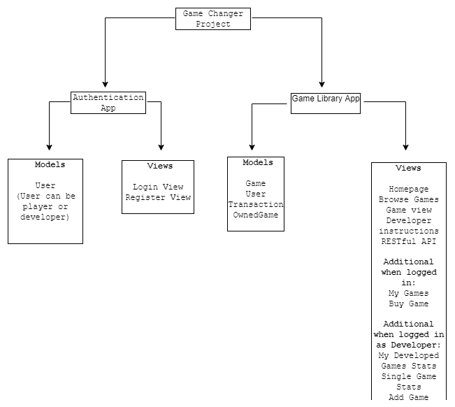
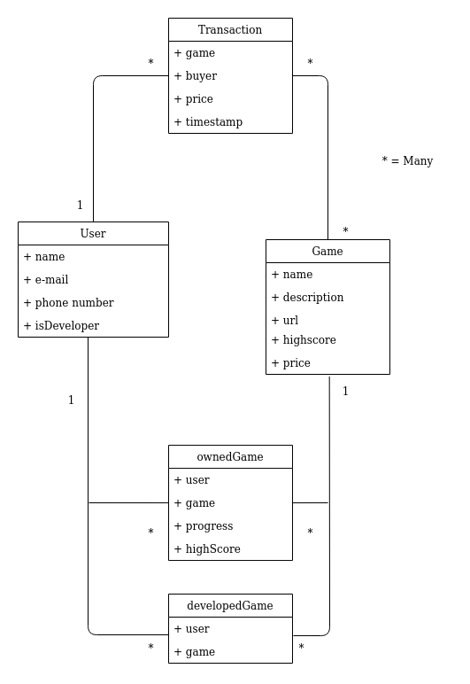

# Game X Changers

CS-C3170 Web Software Development 2019 / 2020 
Course Project

Tervo, Miikka   654058  miikka.tervo@aalto.fi
Jokinen, Ekku	666091	ekku.jokinen@aalto.fi
Määttä, Arttu	667155	arttu.maatta@aalto.fi

## Overview

### Product vision

Our project is a website where users can develop, purchase and play games. Users are divided into players and developers. Players are able to browse games, select games of their liking and purchase them. Purchasing is done by first adding all wanted games into a shopping cart and then by proceeding to buy all of them at once. After purchasing a game players are able to play the game. Players can’t play games that they do not own but are presented with a description of the game.
Games are provided by developers. All functionalities of players are also provided to developers but in addition they can add and manage games. Adding games onto the site is done by providing a URL that leads to the game. After adding games developers can edit and delete those games as they wish. Developers are also provided with views that show statistics of their own games.  

### Technical overview

The website is developed using the Django-framework. We will use MySQL as our database. Finished product shall have features listed in the next section of this document. The website should also have a solid foundation to be scaled, security against most common virtual attacks and a decent UI and UX. 

## Features

The features and functionalities we plan to implement are as follows.

### Authentication

User can register to the website as a user or a developer. After registering they can logout/login using their password. Users will be handled using Django auth [1] which provides almost all needed functionalities (permissions/groups/password hashing). We will  also use email validation which is implemented using Django’s email backend [2] .
OpenID logins will be allowed for the website. This will be enabled with the Django-Oauth-toolkit library [3].

### Player functionalities

If a user does not own a game, they are offered an opportunity to buy it. The games chosen are added into a session based shopping cart and the payment is handled using the course’s mockup payment service [4]. Users are able to play games that they have purchased. The players are provided with a ‘Browse games’ view. The view implements a search functionality and lists all the games grouped into categories. These functionalities are implemented with security restrictions kept in mind. For example, players are only able to play games that they have purchased (Django auth permissions).

### Developer’s additional functionalities

Developers are able to add games to the site. The games are added by offering the URL to the game. Added games will have a mandatory attribute price and an optional attribute description. Developers are also able to modify games by giving new URLs that will be associated with the games. Developers are able to delete games from the database, too. Developers are provided with a view that lists all of the games that they have developed with some simple statisics presented along them. For each of game developed by the developer they will also be presented with a more detailed statistic-view that shows the amount of sales and when those sales have been made. An overview of all sales of the developer is presented. These functionalities are implemented with security restrictions kept in mind. For example developers are only able to manage their own games.

### Game/service interaction

Communication between the game and the service will happen with window.postMessage. All postMessages will have a messageType attribute. All messageTypes: SCORE, SAVE, LOAD_REQUEST, LOAD, ERROR, SETTING.

### Save/load and resolution feature

A SQL database with one JSON object field will be created that will have data of every user’s all games in progress. When a game is saved, the state of the game is saved to the database under the current user’s id. When a user has a game in progress and wants to play, they can open the game in progress by loading the state of the game from the database. MessageTypes used here are SAVE, LOAD_REQUEST, LOAD. The resolution is adjusted with the messageType SETTING.

### RESTful API

We will make a simple API that shows available games and their high scores. This API will be used by game developers so they can get data of games and develop new games. We will make a view which shows raw data in JSON-format.

### Own game

The objective for our own game shall be that the user has to type the correct random letter that the screen shows as fast as possible. There are levels to the game and the user can pass a level by typing enough letters correctly during the time limit. After each level the amount of correct letters increases. The user can save the game at a level and load the game to continue at that specific level. The user’s score is equivalent to the level he/she has got to. The game is developed using HTML, CSS and Javascript.

### Mobile friendliness

We shall develop our website to be mobile friendly, by making the layout of the page responsive. This means that the layout of the views changes depending on the size of the screen. 

### Social media sharing

The user can share games to social media (Facebook, Twitter, Google+). A post about a shared game consists of the name of the game, a description, an image and a link to the game. We shall use Open Graph Protocol to share a game to Facebook, Twitter Cards to share a game to Twitter and schema.org microdata to share a game to Google+. 
Technical Structure

## Views and models

The project is divided into two applications: The authentication and the game library. We divided them in this way because these are the only functionalities of the website that are clearly separate of each other.

### Structure of the product

### Models’ relation structure

	

## Working habits and timetable

We will meet once a week in the beginning of the week to go through that particular week’s goals and tasks. We all are in school otherwise also so working together on the project will be natural, but the weekly meetings help us concentrate on the bigger picture once in a while. We will use Telegram for communication.
The last week before the deadline is meant for minor adjusting and testing. The first group meeting will be on the first week of the year 2020. First tasks are to set up the project environment, make a Hello World-application and deploy it to Heroku.		

## Sources

[1] Django auth documentation by Django:
https://docs.djangoproject.com/en/3.0/topics/auth/

[2] Django email-backend documentation by Django:
https://docs.djangoproject.com/en/2.1/topics/email/#email-backends

[3] Django OAuth Documentation from GitHub by jazzband: 
https://django-oauth-toolkit.readthedocs.io/en/latest/

[4] Courses mockup payment service:
https://tilkkutakki.cs.aalto.fi/payments/

